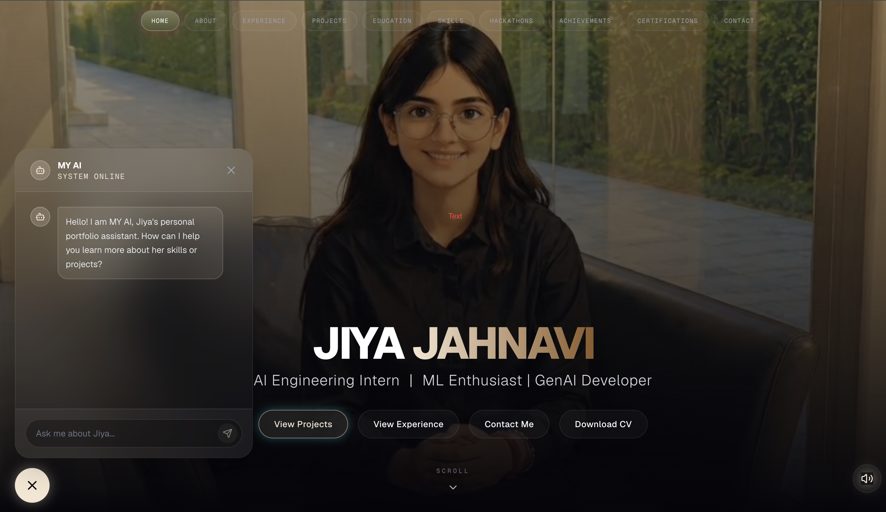

# 🚀 Cinematic AI Engineering Portfolio


*(Place a screenshot or GIF of your portfolio in the `public` folder named `preview.png`)*

> A premium, futuristic, and immersive web experience designed specifically for AI Systems Engineers, Machine Learning Developers, and Generative AI Enthusiasts.

This portfolio steps away from traditional grids and flat designs, embracing a **cinematic, holographic, and interactive** aesthetic. It uses advanced 3D transforms, physics-based animations, and a curated dark-mode color palette to present engineering work not just as code, but as *living intelligent systems*.

---

## 🌌 System Architecture & Tech Stack

This project is built on a modern, high-performance web stack optimized for rapid interactions and heavy animation logic:

- **Framework:** Next.js 16.2.6 (App Router + Turbopack)
- **Styling:** Tailwind CSS (with complex `glassmorphism` and custom gradient overlays)
- **Animation Engine:** Framer Motion (Hardware-accelerated 3D physics & layout transitions)
- **Icons:** Lucide-React (Dynamic SVGs)
- **Deployment:** Vercel (Recommended)

---

## ⚙️ Core System Components

The architecture is strictly modularized into isolated semantic components located in `src/components/sections/`:

### 1. The HUD Hero (`Hero.tsx`)
A cinematic introduction featuring GSAP-style parallax scrolling, animated particle backgrounds, and a staggered typography entrance. It includes glowing Call-To-Action buttons that intercept routing for smooth, layout-preserving navigation.

### 2. 3D Projects Flipbook (`Projects.tsx`)
The crown jewel of the portfolio. Instead of standard grids, projects are presented as a **spine-anchored 3D flipbook**.
- Uses `framer-motion` 3D transforms (`rotateY`, `perspective`).
- Dynamic state management tracking active pages.
- Embedded action buttons (Live Demo & Source Code).
- Data-driven rendering via the `BOOK_PAGES` constant array.

### 3. Neural Node Skills (`Skills.tsx`)
An interactive neural-network visualization of technical skills. Skills are grouped into modular "domains" (AI Systems, MLOps, Backend, etc.) that expand and reveal sub-routines upon hovering, simulating a data-retrieval interface.

### 4. Trajectory Timelines (`Experience.tsx` & `Education.tsx`)
Vertical timeline architectures mapping professional and academic evolution. Connected by a continuously glowing, scroll-linked energy line utilizing Framer Motion's `useScroll` and `useTransform` hooks.

---

## 🎨 Design Philosophy

The aesthetic is specifically tuned to feel like an **AI Research Terminal** or **Holographic Engineering Interface**:
- **Color Palette:** `Midnight Black` (#0a0a0a) combined with `Primary Warm Beige/Mocha` (#f5e6d3) and `Secondary Amber/Gold` (#8b5a2b).
- **Typography:** Sleek, monospaced tech accents (`font-mono`) paired with heavy, tracked-out sans-serif headings.
- **Glassmorphism:** Widespread use of `backdrop-blur` and translucent white borders (`border-white/10`) to create physical depth without heavy drop shadows.

---

## 🛠️ Local Installation & Development

To spin up the portfolio locally and modify the data matrices:

1. **Clone the repository:**
   ```bash
   git clone https://github.com/jiyajahnavi/portfolio.git
   cd portfolio
   ```

2. **Install dependencies:**
   ```bash
   npm install
   ```

3. **Initialize the Development Server (with Turbopack):**
   ```bash
   npm run dev
   ```

4. **Access the HUD:**
   Open [http://localhost:3000](http://localhost:3000) in your browser.

---

## 📝 Configuration & Customization

To swap out my data for yours, navigate to the respective component files in `src/components/sections/`. 
All content (Projects, Experience, Skills) is driven by constant arrays at the top of each file. Simply replace the text strings, image URLs, and GitHub links in the arrays, and the UI will automatically adapt and animate the new data!

---
*System Initialized. Ready for deployment.*


